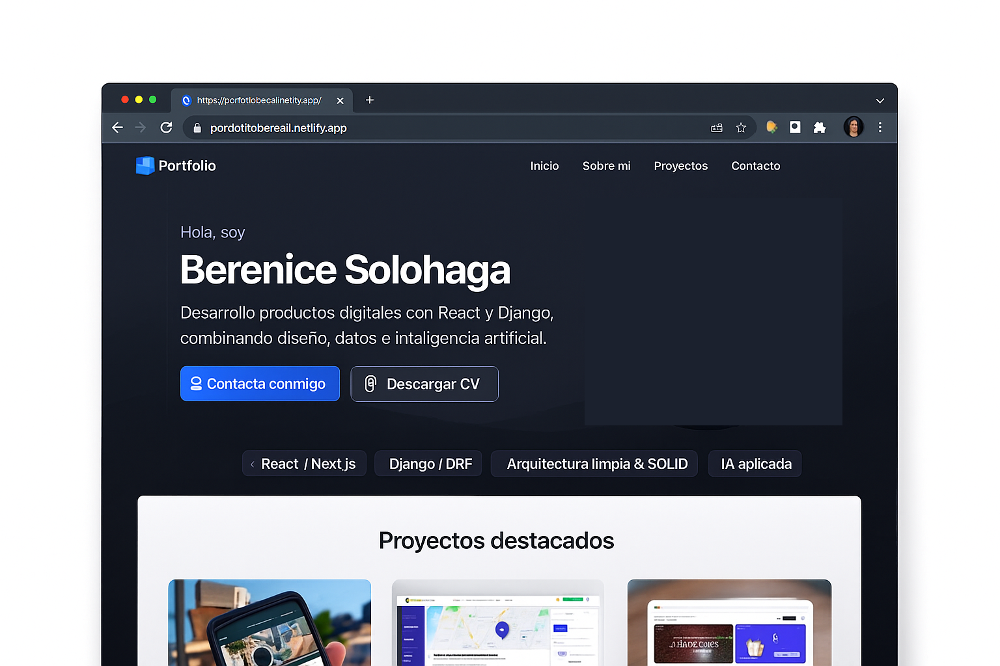

# 🌐 Portfolio — Berenice Solohaga

Este repositorio contiene el código de mi **portfolio personal** como desarrolladora **Fullstack**.  
Es la web donde centralizo quién soy, qué hago y en qué proyectos estoy trabajando.

🔗 **Demo online:** https://portfoliobereail.netlify.app  
🔗 **Web personal / marca:** https://ailonline.com.ar  

---



## 👩‍💻 Sobre mí

Soy **Berenice Solohaga**, desarrolladora **Fullstack** (Python/Django REST + React/Next.js).  
Me enfoco en:

- Aplicaciones web escalables y mantenibles.
- Buenas prácticas: arquitectura limpia, SOLID, separación por capas.
- Integración de APIs, bases de datos relacionales y despliegue en la nube.

Este portfolio resume mi perfil técnico y muestra algunos proyectos clave.

---

## ✨ ¿Qué muestra este portfolio?

Secciones principales (dependiendo de la versión actual):

- **Inicio / Hero** – Presentación rápida: quién soy, stack principal y CTA para contactarme.
- **Sobre mí** – Resumen de experiencia, enfoque y qué tipo de trabajo busco.
- **Skills** – Tecnologías que uso: Frontend, Backend, Bases de datos, DevOps, etc.
- **Proyectos destacados** – Cards con descripción corta, stack y enlaces (GitHub + demo).
- **Contacto** – Links a mis redes y formulario / mail.

Algunos proyectos que destaco desde aquí:

- 🗿 **StatuApp — Rosario en Estatuas**  
  Catálogo cultural de estatuas y monumentos de Rosario con mapa y fichas.  
  Frontend: Next.js + TypeScript · Backend: Django REST  
  Repo: https://github.com/bereail/statuapp

- 📚 **ReadMe — Registro de lecturas y notas**  
  App fullstack para registrar libros leídos, fechas, puntajes y notas por página.  
  Frontend: React/TypeScript · Backend: Django REST  
  Repo: https://github.com/bereail/ReadMe-Fullstack-App-Django-REST-React-

- 🖨 **stockToner**  
  Sistema para gestionar stock de tóner entre distintos servicios.  
  Backend: Django + DRF  
  Repo: https://github.com/bereail/stockToner

---

## 🧱 Stack tecnológico de este portfolio

- **Framework:** Next.js (App Router)  
- **Lenguaje:** TypeScript  
- **Estilos:** CSS (y utilidades según la versión: Tailwind CSS / etc.)  
- **Build & Routing:** create-next-app, rutas tipo SPA con SEO básico.

> Si querés ver exactamente las dependencias, revisá `package.json` en este repo.

---

## 📁 Estructura básica del proyecto

```bash
PORTFOLIO/
├── app/              # Páginas y layout principal (Next.js App Router)
├── components/       # Componentes reutilizables (UI, layout, secciones)
├── lib/              # Utilidades, hooks, helpers
├── public/           # Imágenes, íconos, favicons
├── data.tsx          # Datos estáticos (links, proyectos, redes, etc.)
├── next.config.ts    # Configuración de Next.js
├── tsconfig.json     # Configuración de TypeScript
└── package.json      # Dependencias y scripts
🚀 Cómo correrlo en local
Clonar el repositorio

bash
Copiar código
git clone https://github.com/bereail/PORTFOLIO.git
cd PORTFOLIO
Instalar dependencias

bash
Copiar código
npm install
# o
pnpm install
# o
yarn
Levantar entorno de desarrollo

bash
Copiar código
npm run dev
Abrí http://localhost:3000 en el navegador para ver el sitio.

☁️ Deploy
Este portfolio puede deployarse en cualquier plataforma compatible con Next.js, por ejemplo:

Vercel

Netlify

Render, etc.

En producción lo tengo publicado en:

🔗 https://portfoliobereail.netlify.app

📬 Contacto
Si querés hablar sobre oportunidades laborales, freelance o colaboraciones:

🌐 Web: https://ailonline.com.ar

💼 LinkedIn: https://www.linkedin.com/in/berenice-solohaga

🐙 GitHub: https://github.com/bereail
